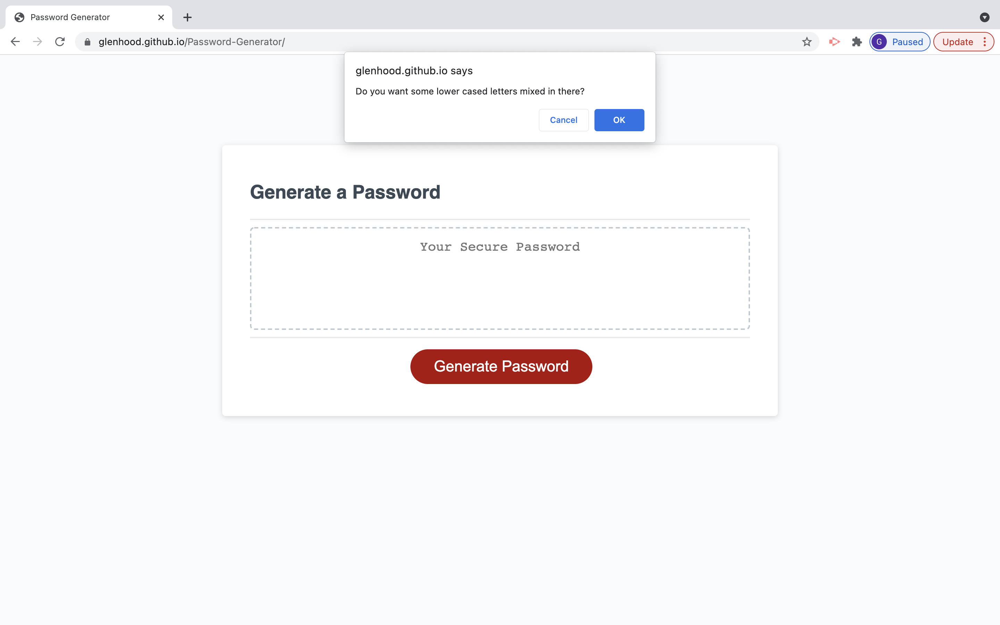

Password Generator

https://glenhood.github.io/Password-Generator/

I created password generator that will generate a password between 8 and 128 characters. The user has the option to include uppercase letters, lowercase letters, numbers, and special characters in thier randomized password. These characters are chosen by the user by using a series of alerts.
    

Credits-
www.w3schools.com was used as refrence
Robert Kurle (tutor) assisted with if statements